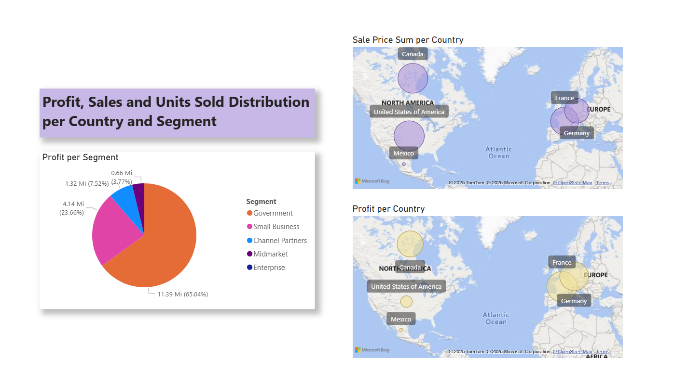
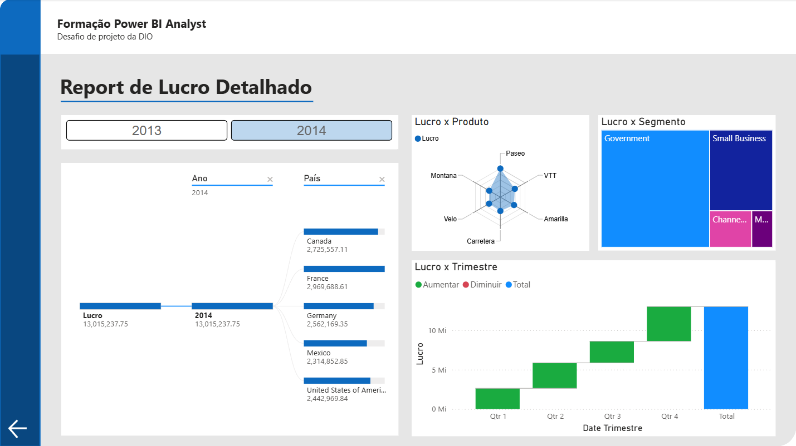

# Randstad Data Analysis Bootcamp

This repository is intended to document my experience throughout the Randstad Data Analysis Bootcamp. All code and documentation will be primarily in English, even though the classes were conducted in Portuguese (PT-BR). This choice is intentional, as I aim to improve my English skills while building this repository.

## Prologue: First Steps
We started with some Git courses to introduce code versioning and portfolio creation. Since I've been familiar with GitHub for a while now, it was mostly a good refresher.

## Chapter I: Artificial Intelligence (AI)
The first chapter focused on introducing the fundamentals of AI, including its key concepts and applications. We explored the differences between AI, Machine Learning (ML) and Natural Language Processing (NLP), uderstanding how AI serves as the broader field, while ML allows systems to learn from data and NLP enable machines to process and undestand human language.

## Chapter VII: Data Analysis with Excel and Copilot

## Chapter VIII: BI Fundamentals
This was one of the chapters I enjoyed the most! Although it was quite challenging - particularly because I had never worked with Power BI before - it turned out to be incredibly engaging and rewarding. Learning how to navigate a new tool pushed me out of my comfort zone, but it also provided valuable insights and a strong sense of achievement.

A highlight of this chapter was the lab project at the end, in which I worked with a financial sample dataset to create interactive reports, like the one shown above. This practical experience helped solidify the concepts and gave me a clearer picture of how BI tools can transform raw data into meaningful insights.

## Chapter IX: Data Visualization and Reports with Power BI
Now we’re definitely getting to the good stuff! In this chapter, we explore key performance indicators (KPIs) and metrics, laying the groundwork for meaningful data visualization and insightful reporting using Power BI. I had a great time working on the final project, and I’m proud of how the dashboard turned out.

## Chapter X: Data Processing with Power BI
This chapter dives into one of the most critical aspects of any data project: data extraction, cleaning, and transformation - also known as ETL. I've learned how to bring raw data to life by preparing it for analysis through Power BI’s data processing tools. 

I've also worked with data from different sources like Excel files, databases and even a few online datasets. Power BI handled the integration pretty smoothly, which made it easier to focus on the actual data preparation. 

The ETL was definitely one of the more technical parts, but also one of the most important. With that said, it took some trial and error, but by the end of the course, I had a much better understanding of how to shape messy data into something usable for analysis.
